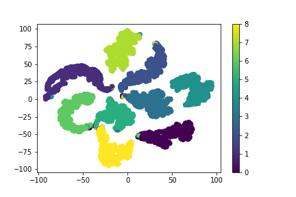

# arcface-mnist
try Metric Learning with MNIST!

## What is this repo?
We try various metric learning with MNIST dataset.

Please see the each notebooks for the codes.

## ArcFace
Please see:
`arcface.ipynb`

## CosFace
Please see:
`cosface.ipynb`

## SphereFace
See:
`sphereface.ipynb`

## CircleLoss (CVPR 2020)
Please see:
`circleloss.ipynb`
